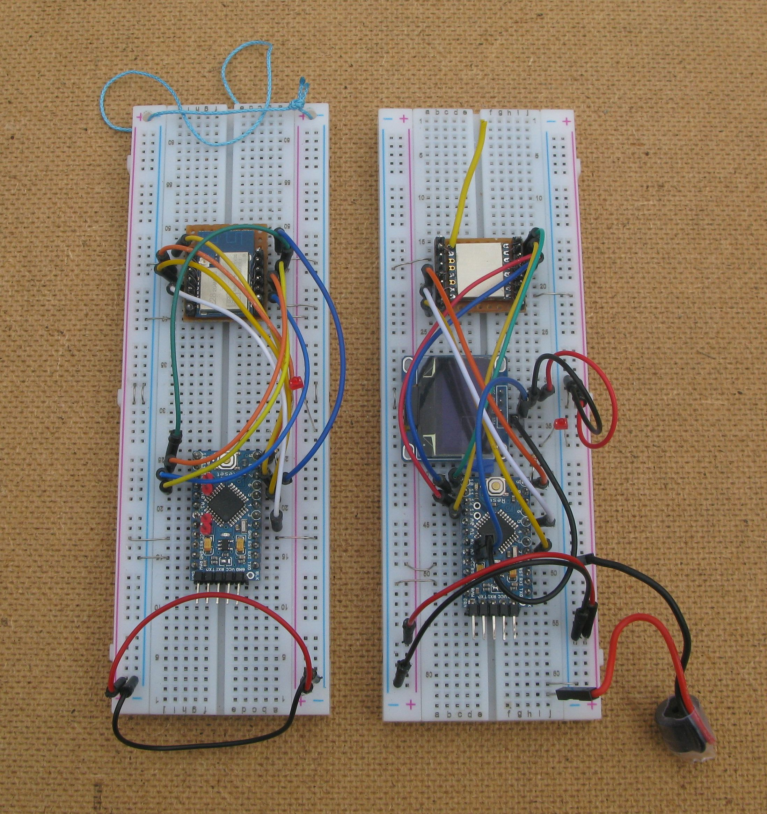
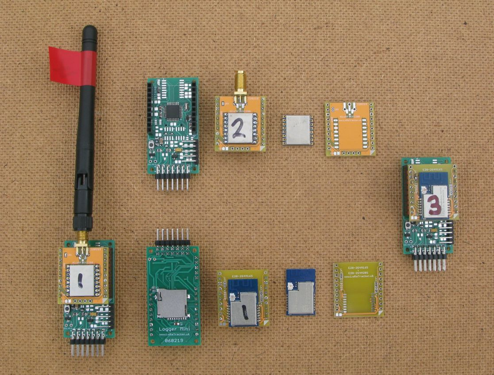

# Semtech SX1280 2.4ghz LoRa Ranging Tranceivers

Available since 2017 the SX1280 LoRa devices are similar to the SX1272 and SX1276/8 LoRa devices that operate in the 434Mhz, 868Mhz and 915Mhz ISM bands.

These 2.4Ghz devices do not have the very long range capability of the lower frequency LoRa devices due to the much higher attenuation of free space at the higher frequency. The devices do however allow for much higher data throughput with data transfer speeds using LoRa of up to 203kbps with few duty cycle restrictions. 

The SX1280 supports LoRa bandwidths of 203khz, 406khz, 812khz and 1625khz. Available spreading factors are SF5 to SF12. Possible coding rates are 4:5 to 4:8. The effective data rates are 297bps to 203kbps. 

The SX1280 supports both a serial UART based interface and an SPI one. I have only tested and used the SPI option. 

The SX1280 has a ranging mode that can measure distance by recording the time of flight of a special packet exchange between two SX1280s. The longest range LoRa settings you can use for ranging are bandwidth 406Khz and spreading factor 10. 

I tested two types of available SX1280 modules, the G-NiceRF LoRa1280 and the Ebyte E28 devices. There are two versions of the Ebyte devices, both have PCB antennas for 2.4Ghz. The E28-2G4M12S is the base module and has 12dBm RF power output. The E28-2G4M20S adds an LNA on the receive side and a power amplifier with 20dBm output on the transmit side. The G-NiceRF is 12dBm output and requires an external antenna.

Semtech produce a development kit with sample code but it was not in a format that allowed for its use in the Arduino environment. The class based structure of the original bits of code was removed and reduced to just two code files, SX1280Library.h and SX1280Includes.h for Arduino. These bits of code currently just need to be included in the same folder\directory as the Arduino .ino file. When I am fully happy with the code it will be published.

The SX1280 is programmed with a series of commands followed by one or more bytes of data which is quite different to the register centric approach of the SX127x. 

  
### First Ranging tests

The first ranging tests were with a E28-2G4M12S (left) and a G-NiceRF device (right). I did not initially have a way of plugging them into a breadboard so I made my own adapters, see picture;

  
Whilst on a break I was staying at Walcot hall in Shropshire, it has a large open field in front of the house. 
  

  
So using the SX1280 devices on a breadboard and some preliminary ranging code, I carried out my first ranging tests. 

    Actual Distance   Indicated Distance. 
    0                 4.4M
    50M               57.6M
    100M              103M
    150M              148M
    200M              201M
    250M              253M

So not too bad, the results did seem to be consistent for large open areas. 
  
## Long Range tests

So short distance ranging seems OK, what about longer distances ?

First I needed a way of connecting 2.4Ghz antennas which normally have SMA type connectors. I designed and had made some Mikrobus and breadboard friendly boards for the Ebyte and G-NiceRF SX1280 LoRa devices, see pictures below;
  
 
  

The larger green PCBs are an ATMega328P based Mini Logger I designed. It can be fitted with a plug in Mikrobus compatible board. Mikroelectronica sell a range of compatible 'Click' boards, see here;

[https://www.mikroe.com/click](https://www.mikroe.com/click)

The SX1280 requires a few more pins than a standard Mikrobus module provides, so I added two pins to the normal 8 on either side for the Busy and DI03 pins, plus the RXenable and TXenable for the E28-2G4M20S. The design of these SX1280 Mikrobus boards does allow them to be used in a standard 2 x 8way Mikrobus socket. This requires that the pin connected to the Mikrobus AN pin is a dual analogue\digital pin which is often the case. 

The Mikrobus PCBs shown, the yellow ones, are breadboard friendly so will plug into a standard 0.1" breadboard, very useful for prototyping. 

A complete Arduino based transceiver fitted with an G-NiceRF SX1280 device is shown on the left of the picture above, complete with 2dBi WiFi antenna. The board was programmed in the Arduino IDE. 

### 4.4km Ranging test

North of the Cardiff where I live there is a ridge and the location is around 150M higher than where my shed is located in the city. From the ridge there is an excellent view of the city. With a SX1280 transceiver on top of the 6M mast attached to my shed there is a relatively clear line of sight from the ridge to the device on the mast, the distance is 4.4km. I use this link quite often for testing stuff.

 
  

I wrote ranging software that would first transmit a ranging request at high power (10dBm!) and report whether the ranging request completed. The transmit power was then reduced and another ranging request made. In this way it was possible to work out the minimum power required for the ranging to work. 

Over the 4.4km link the ranging worked down to -14dBm. Thus if the full power was used, 10dBm, this test indicates the ranging may have potential to work at over 69km.

  
### Further than 4.4km ?

From the results of the 4.4km test it's possible I could measure the 40km hilltop to hilltop line of sight I have from North of Cardiff across the Bristol channel to the Mendip hills. 

  
### 40km Ranging Test

The Cardiff location for the 40km link test is just North of city (altitude 264m) and the other end of the 40km line of sight is Black Down (altitude 325m) in the Mendips, the other side of the Bristol channel.  
  

  
Route 'Marconi' on the map is the where the first radio transmission across water took place in 1897, by Mr Marconi.

The route has good line of sight and plenty of altitude in the middle of the route to reduce Fresnel zone effects, see the profile below.

  

  
At the Cardiff end there was a SX1280 ranging receiver fixed to a pole and another for a basic link test. Ehe view towards the Mendips is below;

    

  
The view from the Mendips end towards Cardiff was similarly murky;

  

  

At the Mendips end I had a matching set of devices, one as the ranging test instigator/transmitter and another for receiving  basic link test packets. The results were logged to a micro SD card for later analysis. 

At the Cardiff end the SX1280 ranging receiver would listen for the ranging requests from the transmitter at the Mendips end and send the response. Basic 2dBi antennas were used at both ends. 

At the Mendips end the ranging request transmitter would emit a long beep at the start of the test sequence, send a ranging request at 10dBm, then 9dBm, 8dBm etc. If the ranging request was successful then the would be a short beep. Thus to work out the power level when the ranging stopped working you only had to listen for the long beep and then count the short beeps. 

The LoRa settings for the ranging were SF10 and bandwidth 406khz, the longest range settings that the SX1280 allows for ranging mode. There should have been a link disadvantage of 8dBm over the longest range mode the SX1280 can be set to for point to point LoRa. 
  
#### Ranging calculations

I have yet to fully implement in full the ranging result calculation in my ranging test code, so my program would read the results from the ranging result registers (3 bytes) and log the result to the SD card on the logger. 
The path used for the '4.4km Ranging test' mentioned above was used to test and calibrate the ranging function. The ground distance was 4.42km as measured on Google maps. The average ranging result from the SX1280 was 24515. This gave a conversion factor to metres of 0.1803.

The average ranging result for the Cardiff to Mendips link was 225982. Applying the 0.1803 conversion factor gives a distance of 40.745km. The distance taken from Google Maps was 40.65km. So the SX1280 ranging produced a measurement of +0.2% over actual. Not bad.  
  

## Summary - Distance Potential of the SX1280 ranging and point to point.

The ranging requests were received down to 4dBm over the 40km link. This would imply a potential range of 80km LOS at 10dBm. Even modestly improved antennas at both ends (see antenna comparisons above) could double this range.

The longest range settings for point to point mode, SF12 and bandwidth 203khz should have a link advantage of 8dBm over the ranging settings described above, SF10 and bandwidth 406khz.  Converting this 8dBm link advantage over the ranging settings, suggests a potential range for point to point LoRa in the 200km region.     
     
  

### Stuart Robinson
### GW7HPW
### April 2019